# Abstract

Cluster assignments from spatial transcriptomics workflows can contain isolated
errors, fragmented regions, and unstable boundaries because clustering is commonly
performed in a transcriptomic representation rather than directly on tissue
coordinates. We developed SpatialGraphRefine, a clustering-agnostic post-processor
that uses only spatial coordinates and initial labels. An exact k-nearest-neighbor
graph is constructed independently for each tissue section with a C++ kd-tree.
Distance-weighted class support is updated synchronously, but a label can change
only when its current assignment has low local support and an alternative class
passes consensus and margin gates. This discordance gate is designed to correct
isolated errors while limiting damage to plausible boundaries and small domains.
After using three development seeds to establish defaults, we evaluated the frozen
method on 1,120 held-out simulations spanning ten geometries, four corruption
fractions, four error mechanisms, and seven independent seeds. Mean accuracy
increased from 0.788 to 0.832 and adjusted Rand index from 0.561 to 0.649.
Overall accuracy was 0.0064 higher than the published SpaGCN refinement rule and
0.0216 lower than the more aggressive GraphST refinement rule. GraphST's gain was
accompanied by a 0.0441 higher damage rate among initially correct labels. Relative
to SpaGCN, the proposed method improved boundary accuracy by 0.0045 while reducing
damage by 0.0032. Under independent label noise,
accuracy reached 0.946, 81.6% of erroneous assignments were corrected, and 97.9%
of changed labels were correct. The method appropriately provided little benefit
for spatially coherent regional swaps, which are not identifiable from coordinates
alone. On an Apple M3 CPU, 500,000 observations required 3.18 seconds and 434 MB
in two dimensions, or 4.77 seconds and 472 MB in three dimensions. These results
establish computational performance, operating conditions, and failure modes;
validation on independently annotated biological datasets remains required.

# Introduction

Spatially resolved transcriptomics (SRT) measures molecular profiles while
retaining the physical location of spots, bins, or cells. A central task is to
partition tissue into domains corresponding to anatomical or pathological regions.
Methods such as BayesSpace [1], BANKSY [2], SpaGCN [3], STAGATE [4], and GraphST
[5] combine expression and spatial context through Bayesian models, neighborhood
features, graph convolution, attention, or contrastive learning. They address the
full domain-discovery problem and generally require expression matrices,
method-specific preprocessing, and model fitting.

Large benchmarks have found complementary strengths rather than a universal best
method. Yuan et al. evaluated 13 methods on 34 SRT sections and identified
noncontinuous domains and large-scale data as continuing challenges [6]. Kang et
al. subsequently evaluated 19 methods on 30 real and 27 synthetic datasets and
reported substantial platform dependence [7]. A modular post-processing method can
therefore be useful: an upstream method supplies transcriptomically meaningful
labels, after which a lightweight spatial procedure tests whether individual
assignments are locally plausible.

Spatial label refinement is related to classical graph label propagation [8],
Potts and Markov random-field image models [9], neighborhood voting, and
morphological filters. SpaGCN and GraphST also distribute explicit label-refinement
functions: SpaGCN applies a strict local-majority replacement rule, whereas GraphST
unconditionally replaces each label with the modal label among 50 nearest
neighbors [3,5]. These direct post-processing operators are relevant comparators
because, like SpatialGraphRefine, they accept existing labels and spatial
coordinates. Unconditional smoothing can nevertheless erase thin structures or
propagate incorrect labels.

SpatialGraphRefine does not introduce a new general theory of graph propagation.
Its contribution is a conservative correction rule tailored to already clustered
spatial data: exact local geometry, distance-weighted voting, a current-label
discordance gate, consensus and margin gates, per-sample automatic neighborhoods,
diagnostics, and a scalable C++ implementation behind a two-input R interface. We
evaluate not only correction accuracy but also erroneous-change rate, boundary
preservation, rare-domain survival, abstention on non-identifiable errors,
invariance, coordinate pathologies, and computational scaling.

# Methods

## Problem and scope

Let $X \in \mathbb{R}^{n \times d}$ contain coordinates for $n$ observations in
$d=2$ or $d=3$ dimensions and let $y_i^{(0)}$ be an initial cluster assignment.
The method estimates refined labels $y_i^{(T)}$ under the limited assumption that
most assignments are correct and isolated disagreements are more likely to be
errors than spatially coherent labels. It does not use expression or histology and
cannot identify a spatially coherent region that has been assigned the wrong label.
Graphs are constructed separately for each sample or slide.

## Exact spatial graph

An exact kd-tree is built for each sample. Observation $i$ is connected to its $k$
nearest neighbors $N_i$. With $n_s$ observations in sample $s$, the automatic rule
is

$$k_s = \min(31, \max(11, \mathrm{round}(1.6\log_2 n_s))).$$

This sample-specific rule avoids selecting a large neighborhood for a small slide
merely because it was supplied with other samples. The graph is built once and
reused during refinement.

## Distance-weighted support and discordance gating

For neighbor $j \in N_i$, let $d_{ij}^2$ be squared Euclidean distance and let
$h_i^2$ be the squared distance to the farthest retained neighbor. At iteration
$t$, neighbor support for class $c$ is

$$V_{ic}^{(t)} = \sum_{j \in N_i} \exp(-d_{ij}^2/h_i^2)
I(y_j^{(t)}=c).$$

Let $W_i=\sum_{j \in N_i}\exp(-d_{ij}^2/h_i^2)$. Current-label support is
$q_i=V_{i,y_i^{(t)}}^{(t)}/W_i$. A label is eligible to change only if
$q_i\leq0.25$. This is the discordance gate. Eligible observations receive an
additional current-label prior,

$$S_{ic}^{(t)} = V_{ic}^{(t)} + \rho W_i I(y_i^{(t)}=c),$$

with $\rho=0.12$. The best alternative must have normalized support of at least
0.56 and exceed the second-best class by at least 0.10. Updates are synchronous
and stop after three iterations or convergence. The returned `support` value is
the winning local vote fraction; it is a diagnostic score, not a calibrated
probability.

## Implementation and user interface

The algorithm is implemented in C++17 with an R wrapper:

```r
refined <- refine_spatial_clusters(xy, labels, samples = NULL)
```

Advanced controls are contained in one optional list and are unnecessary for the
default workflow. The kd-tree requires expected $O(n\log n)$ construction time.
Refinement requires $O(Tn(k+C))$ time for $T$ iterations and $C$ classes; stored
neighbors and distances require $O(nk)$ memory. No CUDA performance is claimed in
this work.

Large datasets can alternatively be partitioned into non-overlapping tile cores
with overlapping input halos:

```r
refined <- refine_spatial_clusters(
  xy, labels, samples,
  execution = list(tiles = "auto")
)
```

Automatic tiling targets 100,000 observations per tile and distributes tiles over
available physical CPU cores. The default halo extends each core by 15% of its
width in every coordinate dimension. Graph refinement is run on the core plus
halo, but only core predictions are retained, giving every observation one
deterministic owner. CUDA and Metal names are supported through a registered
provider interface; this release ships only the C++ CPU provider and falls back
with a warning unless strict backend selection is requested.

## Development and confirmatory design

Initial geometric pilots and three development seeds per condition were used to
identify failure at clean and sub-neighborhood boundaries and to add the
discordance gate. The defaults above were then frozen. Confirmatory results use
only seven additional seeds that were not inspected during development. Geometry
families overlap between development and confirmation, so this is a seed-held-out,
not geometry-held-out, evaluation.

## Simulated tissue geometries and errors

Observations were sampled within an irregular tissue mask. Ten 2D families
represented jagged stripes, wavy layers, rings, spiral arms, branching sectors,
warped lobes, rare islands, disconnected same-label domains, thin layers, and
intermixed microdomains. Curved layers were also simulated in 3D. Each confirmatory
dataset contained 12,000 observations and five domains.

Four error mechanisms were applied at 5%, 15%, 25%, and 40%:

- independent random flips;
- errors concentrated near analytic boundaries;
- spatially correlated patches with heterogeneous replacement labels;
- coherent regional relabeling to one class.

The last mechanism is a negative identifiability control. Additional experiments
varied domain number from 2 to 12, feature width, spatial density, sampling holes,
coordinate duplication, z-axis scaling, and clean labels.

{ width=58% }

## Comparators and ablations

We restricted comparisons to direct label post-processors that receive fixed
coordinates and initial assignments. We did not run complete spatial-clustering
pipelines because they solve a different problem and use additional expression or
histology inputs. Source-faithful C++ implementations reproduced the published
refinement functions of SpaGCN and GraphST. SpaGCN included the focal observation
with its nearest neighbors and changed a label only when its count was below half
the neighborhood and another label exceeded half; we used six neighbors for
hexagonal layouts and four for square lattices [3]. GraphST replaced every label
with the first distance-ordered modal label among its 50 nearest observations [5].
Native outputs were tested against literal R translations of the public source.

Matched C++ kNN used the exact same automatically selected graph as the proposed
method, with uniform weights, one iteration, and no gates. A Potts-like iterative
conditional-mode baseline used uniform votes and a fixed current-label prior.
Weighted one-pass voting was retained only as an ablation. Regular 200 by 200 grids
additionally compared one-pass and iterated 3 by 3 modal filters.

## Metrics and statistics

Primary synthetic endpoints were accuracy and adjusted Rand index (ARI). Secondary
endpoints were macro recall, worst- and smallest-domain recall, analytic-boundary
accuracy, interior accuracy, changed-label precision, correction recall among
initial errors, damage rate among initially correct labels, area distortion,
runtime, and process memory.

Analytic boundary proximity was derived from the generating function rather than
from the refinement graph. The primary boundary band contained observations within
10% of a normalized domain interval. Method differences were paired within every
geometry, error level, error mechanism, and seed. We report mean paired differences
with nonparametric 95% bootstrap intervals from 10,000 resamples. Runtime scaling
used three independent processes per condition and `/usr/bin/time -l` for peak
resident memory.

# Results

## Confirmatory performance across 1,120 held-out datasets

The confirmatory matrix comprised 10 geometries, four noise levels, four error
mechanisms, and seven held-out seeds, totaling 1,120 datasets and 13.44 million
unique simulated observations. SpatialGraphRefine increased mean accuracy from
0.788 to 0.832 (paired difference 0.0445, 95% CI 0.0398 to 0.0494) and ARI from
0.561 to 0.649. Mean smallest-domain recall increased from 0.784 to 0.824.

GraphST refinement produced the highest mean accuracy, 0.854, compared with 0.832
for SpatialGraphRefine. The paired difference was -0.0216 (95% CI -0.0257 to
-0.0174). This gain reflected a more aggressive operating point: GraphST damaged
4.60% of initially correct labels, compared with 0.19% for SpatialGraphRefine, and
its boundary-accuracy difference was inconclusive (graph minus GraphST -0.0049,
95% CI -0.0192 to 0.0090). SpatialGraphRefine exceeded SpaGCN refinement by 0.0064
accuracy (95% CI 0.0052 to 0.0077) and 0.0045 boundary accuracy (95% CI 0.0031 to
0.0059), while reducing damage by 0.0032 (95% CI 0.0030 to 0.0034).

Overall accuracy was statistically indistinguishable from matched compiled kNN
voting: paired difference -0.0011 (95% CI -0.0025 to 0.0002). Graph refinement
improved analytic-boundary accuracy by 0.0308 and reduced damage by 0.0186.
Relative to Potts-like ICM, it improved accuracy by 0.00246 and boundary accuracy
by 0.0143 while reducing damage by 0.00402; all three intervals excluded zero.

| Method | Accuracy | ARI | Boundary accuracy | Smallest recall | Damage rate |
|:--|--:|--:|--:|--:|--:|
| Initial labels | 0.788 | 0.561 | 0.647 | 0.784 | 0.000 |
| SpatialGraphRefine | 0.832 | 0.649 | 0.673 | 0.824 | **0.0019** |
| SpaGCN refine | 0.826 | 0.634 | 0.669 | 0.820 | 0.0051 |
| GraphST refine | **0.854** | **0.686** | **0.678** | **0.835** | 0.0460 |
| C++ kNN vote | 0.833 | 0.648 | 0.642 | 0.823 | 0.0205 |
| Potts-like ICM | 0.830 | 0.645 | 0.659 | 0.821 | 0.0059 |

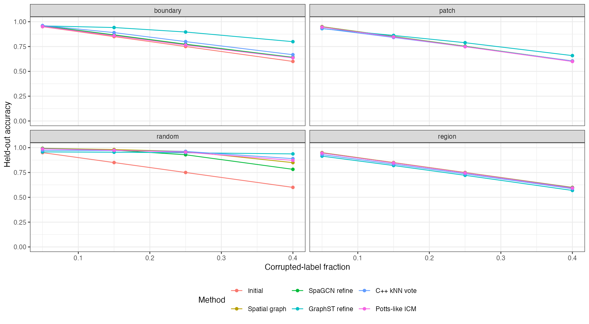{ width=94% }

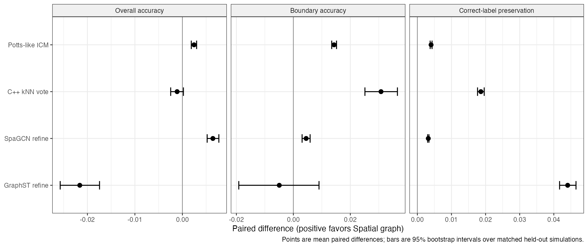{ width=94% }

## Performance depends on the error mechanism

With independent random noise, graph refinement reached 0.946 accuracy, corrected
81.6% of initial errors, and produced correct assignments for 97.9% of changed
observations. Boundary-concentrated noise improved more modestly, from 0.788 to
0.806, because neighboring evidence was intentionally ambiguous. Patch-correlated
errors produced almost no net change (0.789 versus 0.788), with a damage rate of
0.18%. Coherent regional relabeling was not recoverable: accuracy was 0.786 and
changed-label precision was 0.285. The discordance gate nevertheless kept damage
to 0.33%, compared with 3.57% for unconditional kNN.

| Error mechanism | Initial accuracy | Graph accuracy | Changed precision | Error correction | Damage |
|:--|--:|--:|--:|--:|--:|
| Random | 0.788 | **0.946** | 0.979 | 0.816 | 0.0022 |
| Boundary | 0.788 | **0.806** | 0.794 | 0.093 | 0.0003 |
| Patch | 0.788 | 0.789 | 0.415 | 0.019 | 0.0018 |
| Region | 0.788 | 0.786 | 0.285 | 0.005 | 0.0033 |

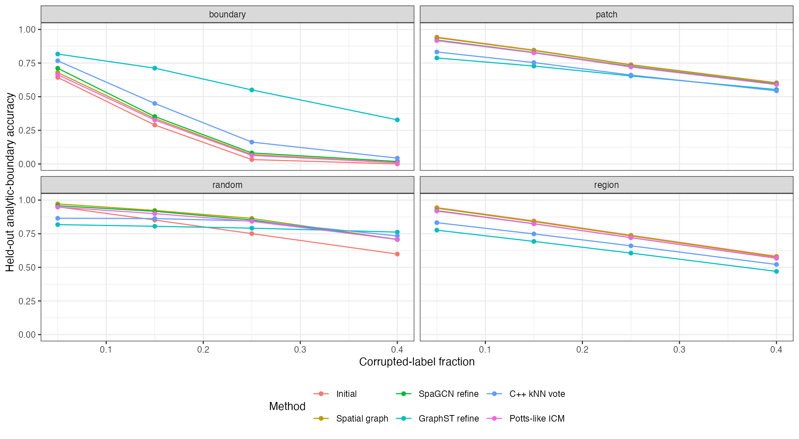{ width=94% }

## Clean labels, rare domains, and thin structures

On clean jagged, thin-layer, and intermixed controls, graph refinement preserved
99.76% of assignments, compared with 99.19% for SpaGCN, 91.83% for GraphST,
95.87% for unconditional kNN, and 98.97% for Potts-like ICM. Rare islands remained
comparatively robust: at the smallest tested relative width, smallest-domain
recall was 0.909, compared with 0.904 for SpaGCN and 0.653 for GraphST. Thin layers
were more difficult; recall decreased to 0.686 at relative width 0.35 and rose to
0.944 at width 1.0. At the smallest width, SpaGCN retained 0.839 recall while
GraphST fell to 0.027, illustrating the severe erosion possible under
unconditional 50-neighbor replacement.
This identifies a practical resolution limit when a structure is narrower than the
local neighborhood.

Across 2, 3, 5, 8, and 12 domains, graph accuracy was 0.944, 0.972, 0.963, 0.936,
and 0.899, respectively. Smallest-domain recall remained 0.946 at 12 domains, but
overall performance declined as boundaries occupied more of the tissue.

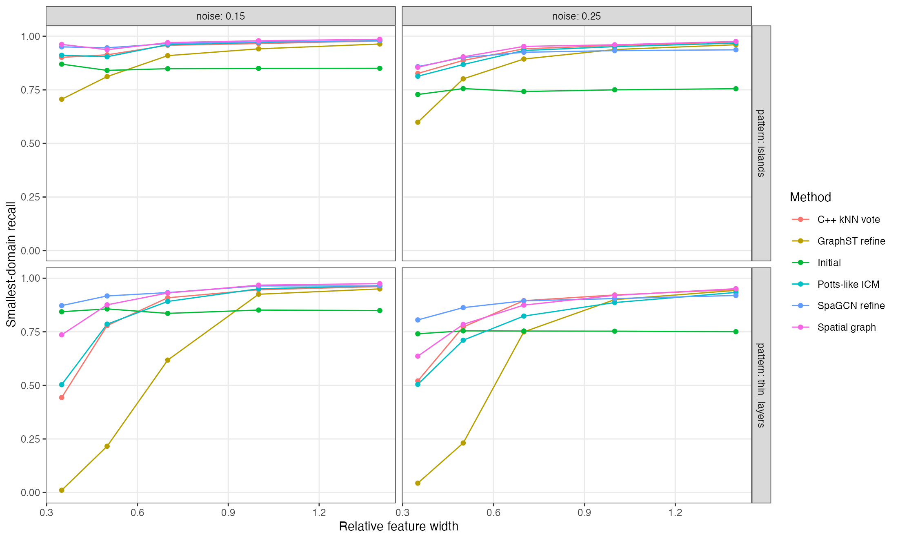{ width=88% }

## Ablation and parameter sensitivity

Removing the discordance gate increased damage from 0.26% to 0.71% in the
ablation set. Unconditional matched kNN caused 1.99% damage. Removing all
confidence gates increased mean accuracy in some correctable scenarios but also
increased inappropriate changes, demonstrating the intended accuracy-preservation
tradeoff. One iteration minimized damage but corrected fewer errors; three
iterations represented the development compromise.

One-factor sensitivity showed stable mean accuracy for 11 to 31 neighbors and
current-support thresholds of 0.15 to 0.25. Larger neighborhoods and removal of
the discordance gate increased damage. No parameter setting recovered coherent
patch or region errors reliably, supporting the identifiability limitation rather
than a tuning explanation.

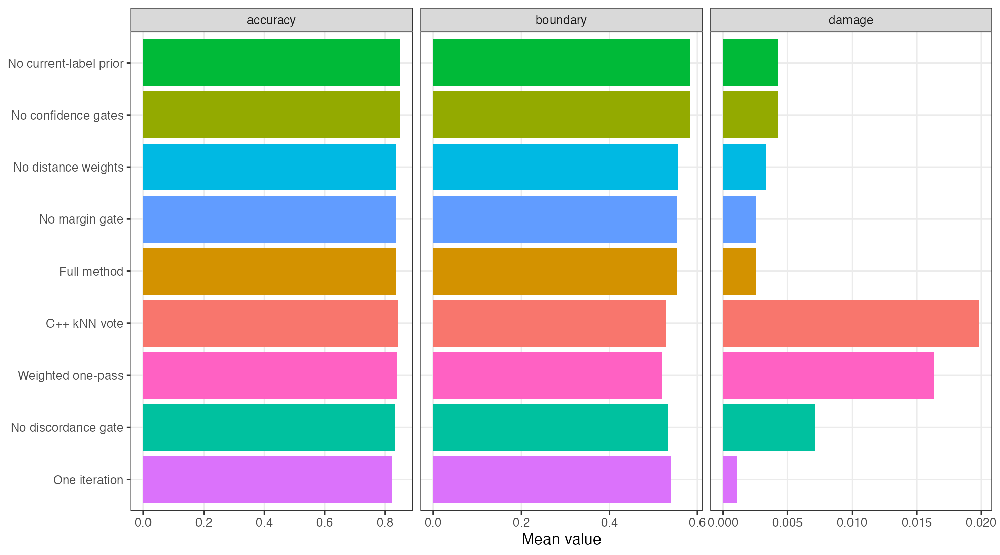{ width=88% }

## Published refiners and regular-grid morphology

The direct comparisons exposed different correction policies rather than one
uniform ranking. GraphST was strongest for boundary-concentrated corruption
(accuracy 0.899) and random flips (0.949), but under coherent regional errors its
accuracy fell to 0.756 and damage reached 6.62%. SpatialGraphRefine retained 0.786
accuracy with 0.33% damage in that non-identifiable setting. SpaGCN remained
conservative but corrected fewer random flips, reaching 0.919 accuracy compared
with 0.946 for SpatialGraphRefine.

On regular grids, iterated 3 by 3 modal filtering achieved the highest mean
accuracy, 0.981, followed by GraphST at 0.973, one-pass morphology and compiled
kNN at 0.959, SpatialGraphRefine at 0.950, and SpaGCN at 0.864. The proposed method
had the lowest nonzero damage rate, 0.07%, versus 1.17% for iterated morphology and
2.70% for GraphST. A regular image lattice therefore supports highly effective
morphological refinement when aggressive smoothing is acceptable.

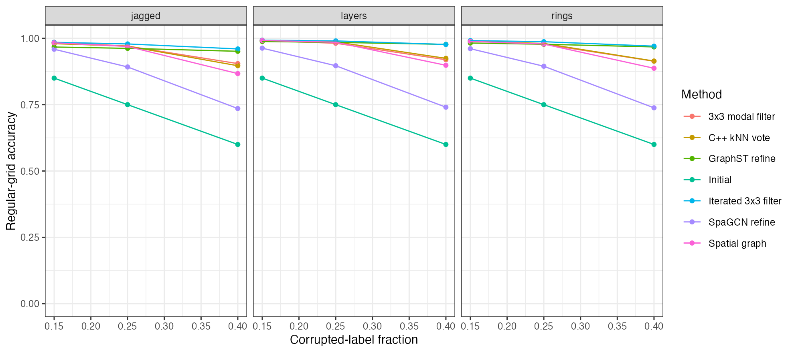{ width=86% }

## Sampling, coordinate scale, duplicates, and invariance

Gradient sampling and spatial holes had little effect in the tested irregular
designs: graph accuracy was 0.967, 0.966, and 0.964 for gradient, holes, and uniform
sampling. Predictions were identical after rotation and translation, row
permutation, and label permutation. Six independently processed samples used 20
neighbors each and achieved 0.940 accuracy.

Three-dimensional coordinates must be expressed in common physical units. Scaling
the numerical z-axis by 0.1 or 10 without correction reduced accuracy from 0.920 to
0.798 or 0.851. Restoring common units recovered approximately 0.920 across all
tests. The package therefore validates dimensionality but deliberately does not
guess physical conversion factors.

Moderate coordinate duplication was tolerated. At 20.7% duplicate positions,
accuracy was 0.959. At 97.6% duplication it decreased to 0.866; at 99.9%, where
coordinates contained almost no spatial information, it fell below the initial
labels. This is another identifiability boundary rather than a computational error.

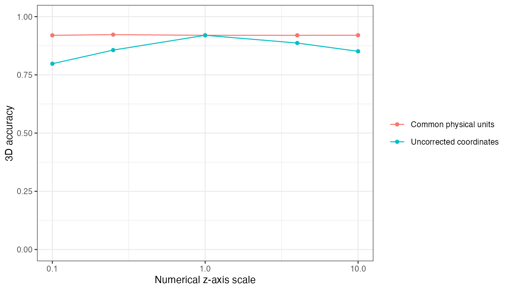{ width=70% }

## CPU scaling to 500,000 observations

Experiments used R 4.6.0 and Homebrew clang 22.1.1 on an Apple M3 with 8 GB RAM.
At 500,000 observations, mean elapsed time was 3.18 seconds in 2D and 4.77 seconds
in 3D. Peak process memory was 434 MB and 472 MB, respectively. At 150,000
observations, runtime was 0.67 seconds in 2D and 1.23 seconds in 3D. No GPU was used.

| Observations | 2D seconds | 2D MB | 3D seconds | 3D MB |
|--:|--:|--:|--:|--:|
| 5,000 | 0.015 | 84 | 0.025 | 86 |
| 20,000 | 0.073 | 96 | 0.131 | 91 |
| 60,000 | 0.241 | 122 | 0.422 | 132 |
| 150,000 | 0.673 | 200 | 1.231 | 229 |
| 500,000 | 3.176 | 434 | 4.766 | 472 |

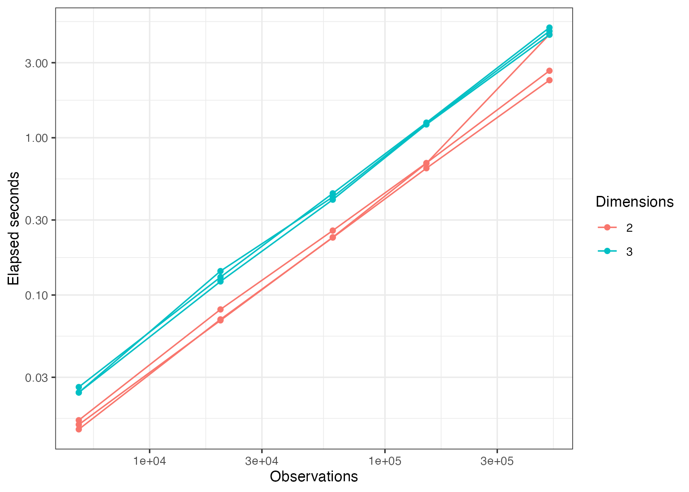{ width=70% }

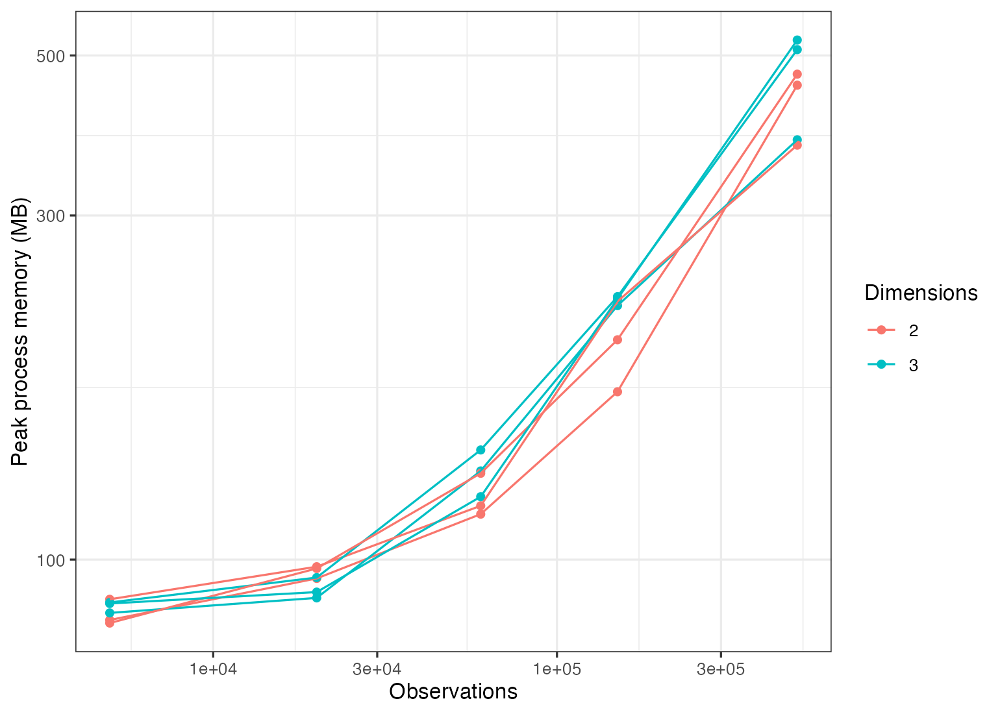{ width=70% }

## Overlapping tiles and CPU workers

We additionally benchmarked two-sample datasets containing 150,000 observations.
With 15% halos, tiled predictions agreed exactly with untiled refinement in 2D and
at 99.9993% in 3D. Four workers reduced tiled runtime from 1.56 to 0.70 seconds in
2D and from 2.71 to 1.34 seconds in 3D. Relative to the already fast untiled run,
four-worker execution was 1.44-fold faster in 2D and 1.34-fold faster in 3D.

Removing overlap reduced agreement to 99.84% in 2D and 98.79% in 3D. Five-percent
halos recovered 100.00% and 99.85%, while the 15% default recovered effectively
complete agreement. The 15% halo processed 1.55 times the unique observations in
2D and 1.93 times in 3D, quantifying the memory and computation tradeoff.

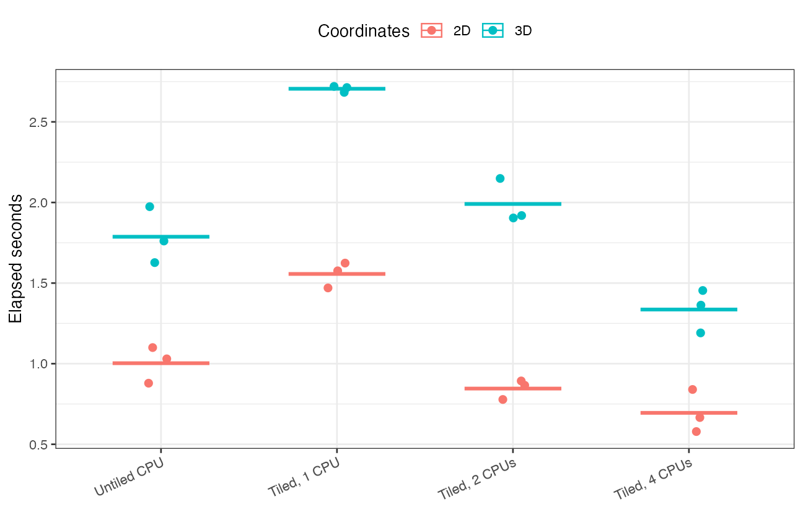{ width=78% }

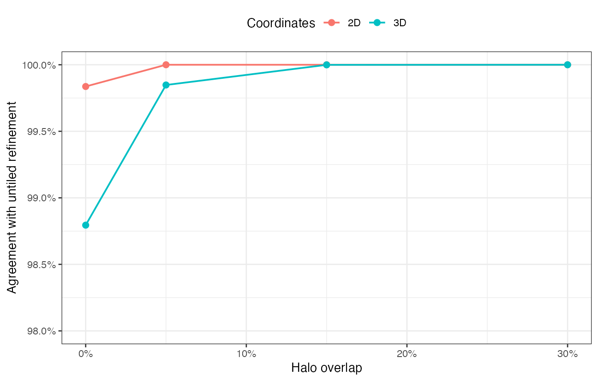{ width=78% }

\clearpage

# Discussion

SpatialGraphRefine is best understood as a conservative error corrector, not a
general spatial clustering algorithm. Its average accuracy was indistinguishable
from unconditional compiled kNN, but it preserved analytic boundaries and initially
correct labels substantially better. Against published direct refiners, it occupied
a conservative operating point. GraphST achieved higher overall accuracy through
many more changes, while SpatialGraphRefine preserved clean labels, thin features,
and non-identifiable coherent regions substantially better. It improved accuracy,
boundary fidelity, and preservation simultaneously over SpaGCN's strict-majority
rule. This behavior follows from the discordance gate: local agreement is used only
when the current assignment is itself weakly supported. The method is particularly
effective for dispersed errors, where nearly 98% of changed assignments were
correct.

The same design imposes clear limits. Coordinate-only methods cannot detect a
spatially coherent region assigned to the wrong class. Thin structures below the
neighborhood scale can be lost, severe coordinate duplication removes identifying
information, and unstandardized 3D units distort neighborhoods. On regular image
grids, iterated morphological filtering was more accurate. The local support score
was also not probabilistically calibrated: held-out expected calibration error was
0.115. It should be used to rank local evidence, not interpreted as a posterior
probability.

The simulation study is extensive but cannot establish biological validity.
Simulated domains still encode explicit local structure, and even the held-out
evaluation reuses geometry families. Before journal submission, the method must be
applied to independently annotated data from multiple technologies. The planned
evaluation includes the 12 DLPFC Visium sections, annotated MERFISH anatomy, a
pathologist-annotated tumor dataset, a high-resolution platform, and multi-section
or 3D data. Each post-processor will receive identical initial labels from several
upstream clusterers. Biological endpoints will include annotation agreement,
marker-gene separation, domain-specific spatially variable genes, histological
concordance, and cross-section stability.

# Software and reproducibility

The R package includes the C++ implementation, geometric simulator, unit tests,
all benchmark scripts, raw per-scenario metrics, paired bootstrap summaries, and
figure-generation code. Before submission, the repository will be made public,
an immutable release will be archived with a DOI, and dataset checksums and session
information will be added. All quantitative statements in this draft are generated
from scripts under `benchmarks/`.

# References

\small

1. Zhao E, et al. Spatial transcriptomics at subspot resolution with BayesSpace.
   *Nature Biotechnology*. 2021;39:1375-1384.
   https://doi.org/10.1038/s41587-021-00935-2
2. Singhal V, et al. BANKSY unifies cell typing and tissue domain segmentation for
   scalable spatial omics data analysis. *Nature Genetics*. 2024;56:431-441.
   https://doi.org/10.1038/s41588-024-01664-3
3. Hu J, et al. SpaGCN: integrating gene expression, spatial location and histology
   to identify spatial domains and spatially variable genes by graph convolutional
   network. *Nature Methods*. 2021;18:1342-1351.
   https://doi.org/10.1038/s41592-021-01255-8
4. Dong K, Zhang S. Deciphering spatial domains from spatially resolved
   transcriptomics with an adaptive graph attention auto-encoder.
   *Nature Communications*. 2022;13:1739.
   https://doi.org/10.1038/s41467-022-29439-6
5. Long Y, et al. Spatially informed clustering, integration, and deconvolution of
   spatial transcriptomics with GraphST. *Nature Communications*. 2023;14:1155.
   https://doi.org/10.1038/s41467-023-36796-3
6. Yuan Z, et al. Benchmarking spatial clustering methods with spatially resolved
   transcriptomics data. *Nature Methods*. 2024;21:712-722.
   https://doi.org/10.1038/s41592-024-02215-8
7. Kang M, et al. Benchmarking computational methods for detecting spatial domains
   and domain-specific spatially variable genes from spatial transcriptomics data.
   *Nucleic Acids Research*. 2025;53:gkaf303.
   https://doi.org/10.1093/nar/gkaf303
8. Zhu X, Ghahramani Z, Lafferty J. Semi-supervised learning using Gaussian fields
   and harmonic functions. *Proceedings of ICML*. 2003:912-919.
9. Besag J. On the statistical analysis of dirty pictures. *Journal of the Royal
   Statistical Society Series B*. 1986;48:259-302.
