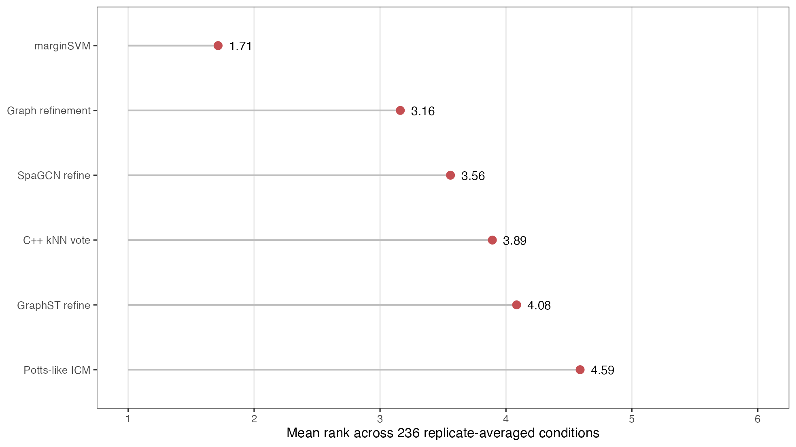
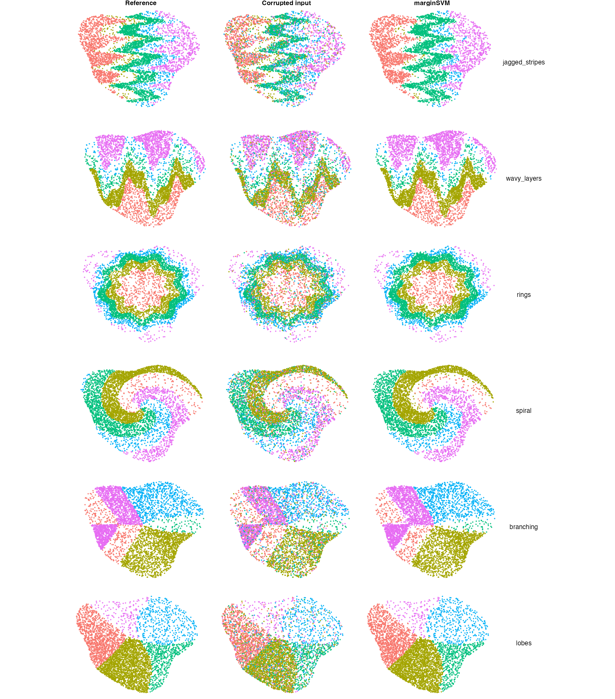
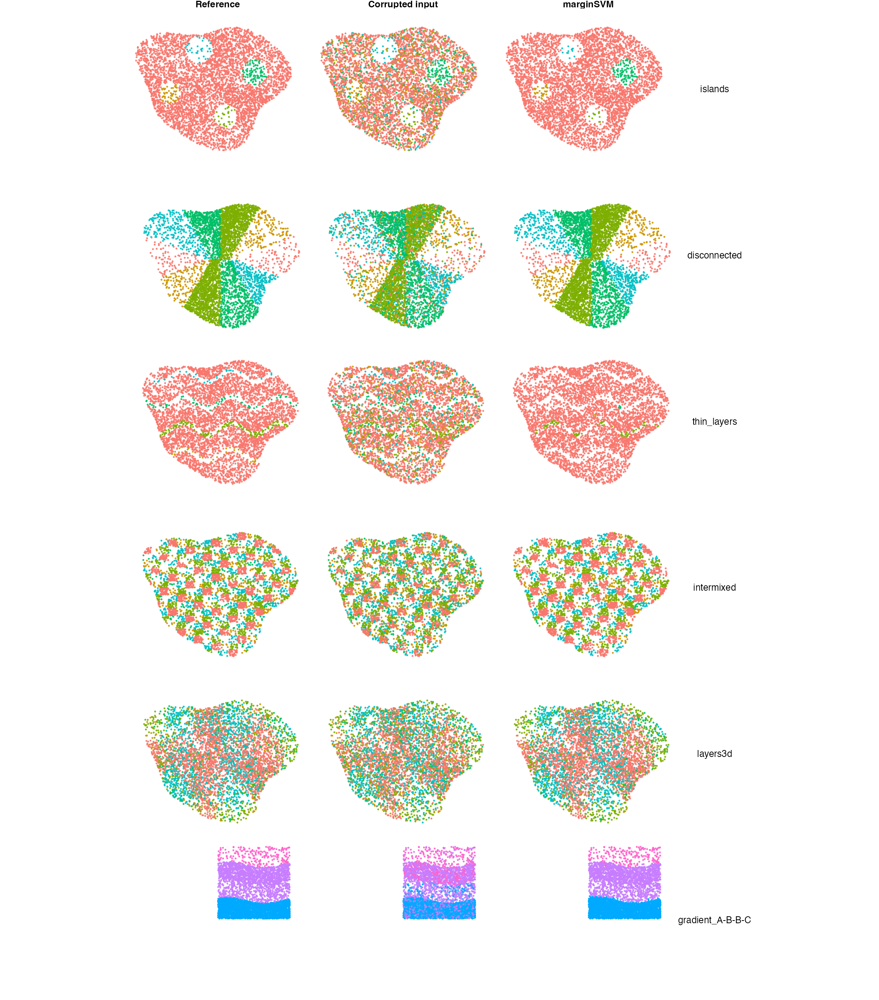
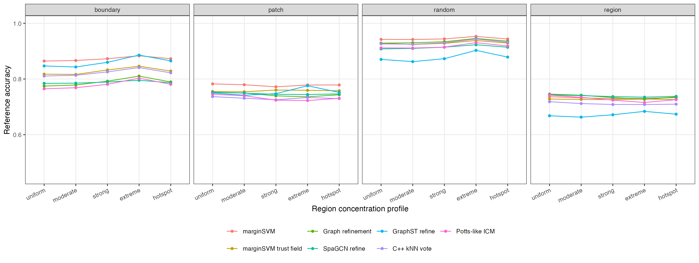
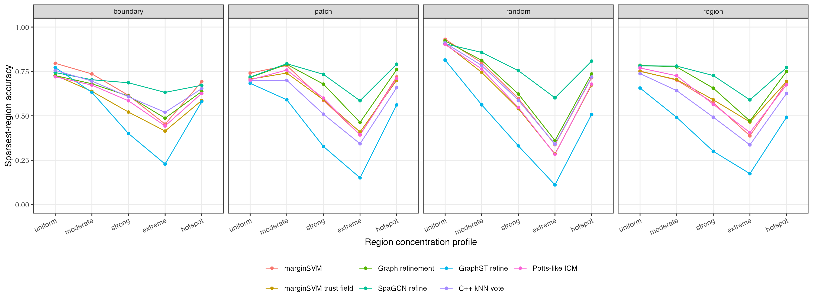
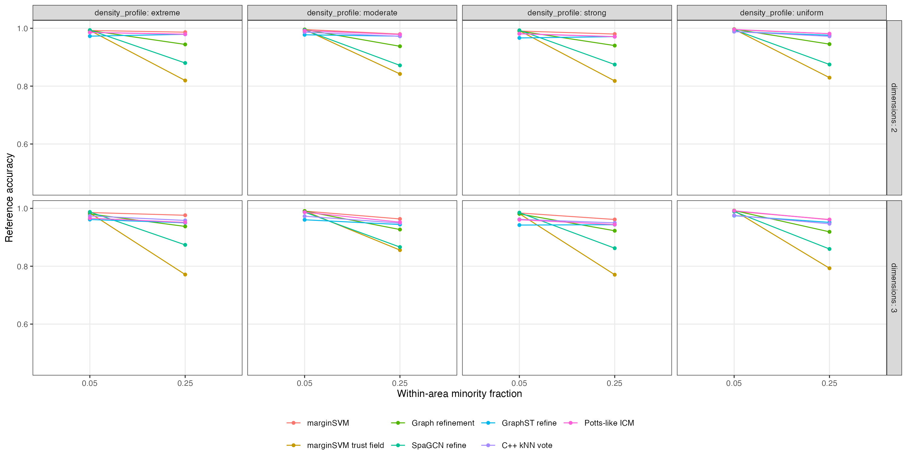
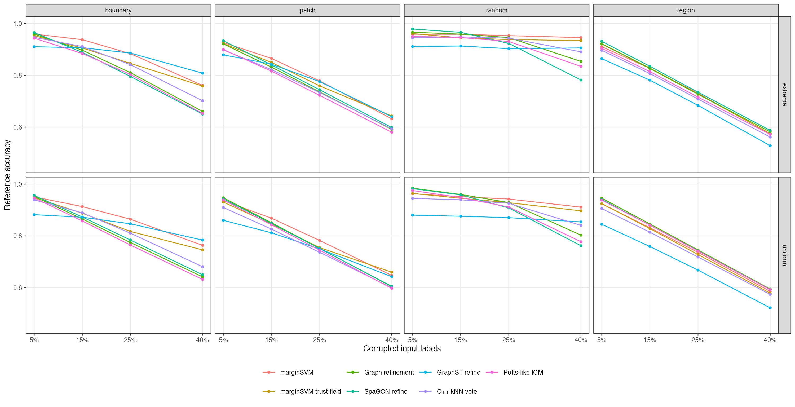
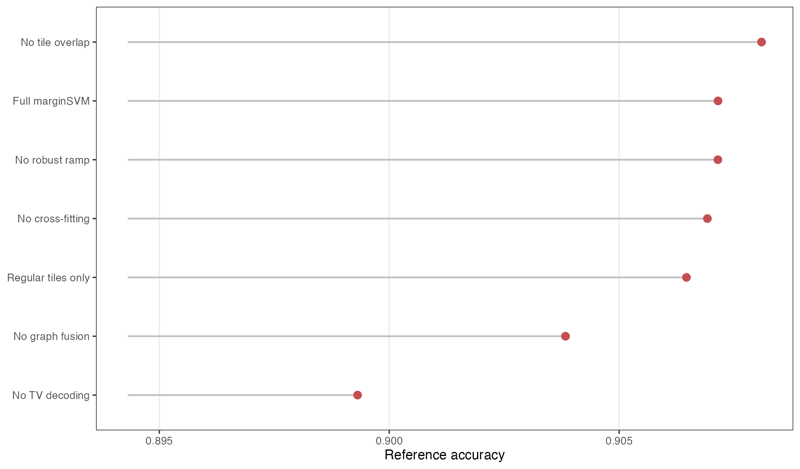
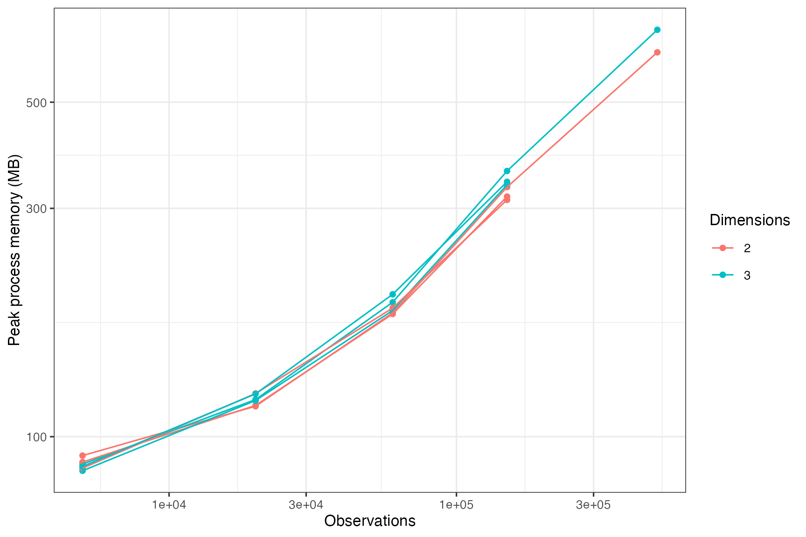
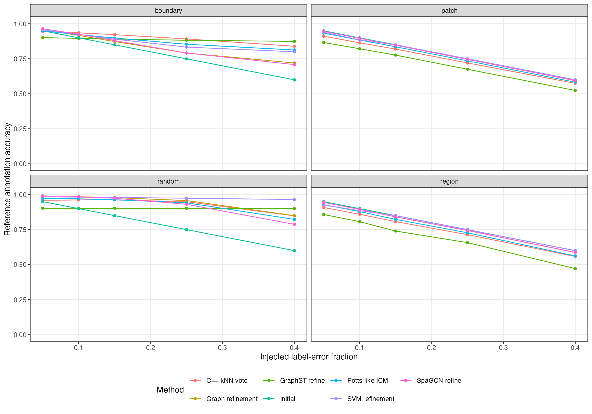

# Abstract

Spatial transcriptomics annotations often contain isolated errors, intermixed
labels, and unstable borders. We developed marginSVM, a clustering-agnostic
post-processor that uses spatial coordinates and optional tissue identifiers.
Overlapping regular and impurity-adaptive tiles contain boundary-enriched Nyström
SVM experts; cross-fitted evidence is fused with uncertain graph support and decoded
by edge-aware multiclass total variation. A topology diagnostic responds to
coherent changes that coordinates and labels alone cannot identify as errors. The
algorithm is implemented in C++17 with a thin R interface. We evaluated 708
simulations spanning 11 geometries, 2D/3D layered gradients, five region-density
profiles, four error mechanisms, and one or three tissues. Across 236
replicate-averaged conditions, marginSVM achieved mean rank 1.71 and 0.8421
accuracy, versus 0.8120 for graph refinement. Its paired accuracy advantage over
each direct comparator was 0.0300-0.0401, with all stratified bootstrap 95%
intervals above zero. SpaGCN better preserved the sparsest regions (0.7409 versus
0.6644), and conservative methods were stronger at 5% corruption; marginSVM ranked
first from 15% to 40%. On 60 untouched controlled corruptions of 194,541 locations
from a real VisiumHD colorectal tissue with 19 biological annotation classes,
marginSVM achieved 0.8664 accuracy. The CPU implementation processed 500,000 points in 6.19
seconds in 2D and 10.14 seconds in 3D. Independent multi-tissue and cross-cohort
biological validation remains necessary.

# Introduction

Spatial domain methods including SpaGCN, STAGATE, GraphST, BayesSpace, BANKSY, and
KODAMA combine expression, histology, and spatial information to discover tissue
structure [1-7]. This study addresses a narrower problem: given coordinates
$X\in\mathbb{R}^{n\times d}$, fixed upstream labels $y_i$, and optional tissue
identifiers, can incorrect assignments be repaired without rerunning clustering?

Only methods that consume the same coordinates and labels are appropriate direct
comparators. We therefore compare published SpaGCN and GraphST label-refinement
rules, nearest-neighbor voting, Potts-like iterative conditional modes (ICM), and a
conservative graph refiner. End-to-end spatial clustering methods are excluded
because they use additional biological inputs and solve a different task. KODAMA
SVM is excluded because it is the precursor of the present method.

A spatial SVM can recover nonlinear borders, but global RBF kernels do not scale to
VisiumHD and ordinary in-sample hinge fitting can reproduce corrupted labels.
Rectangular tiles add capacity but may create seams, and aggressive smoothers can
erase small or thin compartments. We address these problems with local kernel
experts, out-of-fold prediction, robust loss, overlapping score fusion, explicit
spatial regularization, and a conservative response to non-identifiable coherent
label changes.

The contribution is not a new end-to-end clustering model. It is a learning and
systems framework for noisy-label correction under spatial locality. Relative to a
single local spatial SVM, marginSVM adds low-rank nonlinear experts, reproducible
cross-fitting, two complementary tile partitions, continuous overlap fusion, and a
structured graph decoder. Relative to localized SVMs [8,9], it treats the observed
labels as potentially corrupted, fuses overlapping experts instead of assigning
each point to one partition, and couples predictions through an edge-aware
multiclass objective. Relative to the spatial SVM premise in KODAMA [6], the present
method has a separate C++ implementation, algorithm, interface, diagnostics, and
validation; KODAMA SVM is therefore a precursor rather than a comparator.

# Methods

## Learning task and identifiability

For observation $i$, let $x_i\in\mathbb{R}^d$ be its spatial coordinate,
$g_i\in\{1,\ldots,G\}$ its tissue identifier, $\tilde y_i\in\{1,\ldots,C\}$
its fixed upstream label, and $y_i^*$ an unobserved reference label. The task is to
estimate $y^*=(y_1^*,\ldots,y_n^*)$ from $(X,\tilde y,g)$ without expression or
image features. Graphs are block diagonal in $g$, so labels from one tissue cannot
alter another.

The recoverable regime assumes that $y^*$ is locally piecewise regular away from a
boundary set and that corruption leaves enough correctly labeled observations on
both sides of a boundary to identify a margin. We do not assume that every domain
is large, isotropic, or connected. The regime excludes an arbitrary relabelling of
an entire spatially coherent component: for fixed $(X,\tilde y,g)$, both
$y^*=\tilde y$ and a latent labeling that differs on a connected region are
compatible with an unspecified corruption process. No coordinate-and-label-only
algorithm can distinguish those explanations without an additional assumption.
Topology diagnostics and selective output respond to this non-identifiability; they
do not resolve it.

We target low expected pointwise error while controlling damage to initially
correct labels. Because an external reference is unavailable at application time,
the fitted rule uses cross-fitted margin evidence, neighborhood agreement, and
structured spatial regularity as observable surrogates. Accuracy, correction
recall, damage, and rare-region recall are evaluated separately rather than reduced
to one utility with an application-specific cost ratio.

## Spatial neighborhoods and local support

For every tissue independently, a native kd-tree finds the $k=12$ nearest spatial
neighbors. No edge or tile crosses a tissue identifier. Initial-label support is

$$s_i=k^{-1}\sum_{j\in N_k(i)}\mathbf{1}(y_j=y_i).$$

Support guides boundary landmark selection, rare-label retention, and conservative
decoding. It is diagnostic evidence rather than a replacement classifier.

## Overlapping multiscale tiles

Two complementary tile families are generated entirely in C++. Balanced regular
tiles target 5,000 core observations. Adaptive tiles recursively evaluate median
splits in every coordinate dimension and choose the largest reduction in Gini
impurity, $G=1-\sum_c p_c^2$. Splitting is mandatory above the target size and may
continue below it when gain is at least 0.025. Leaves contain at least 250 points.
Every core is expanded by a 25% coordinate halo, allowing adjacent experts to share
training and prediction observations in 2D or 3D.

## Boundary-enriched Nyström features

Each tile selects at most 48 landmarks. Low-support observations are selected first
within each local class, enriching the landmark set near mixed borders, and the
remaining landmarks are sampled reproducibly. Coordinates are normalized within
the halo. For RBF kernel $k_\gamma(x,x')=\exp[-\gamma\|x-x'\|^2]$ with $\gamma=10$,
let $K_{mm}=LL^\top$ be the jittered landmark kernel. The feature map is

$$\phi(x)=L^{-1}k(x,Z),$$

which yields a low-rank kernel approximation without constructing an $n\times n$
matrix [10].

## Robust cross-fitted multiclass SVM

Tile observations are assigned reproducibly to two folds. Model 1 is trained only
on fold 2 and predicts fold 1; model 2 performs the reverse. Thus a point never
supports its own predicted label. For positive class $y_i$ and strongest competing
class $c^*$, the multiclass margin loss is

$$\ell_i=\max[0,1-f_{y_i}(x_i)+f_{c^*}(x_i)].$$

Stochastic updates use capped square-root inverse-frequency class weights, eight
epochs, learning rate 0.01, and L2 penalty $10^{-4}$. After two warm-up epochs,
examples with loss above 2.5 are omitted as likely label outliers, giving a bounded
ramp-like influence. Tile scores are converted to softmax evidence.

## Continuous overlap fusion and graph evidence

For tile center $m_t$, half-width $r_t$, and $d$ dimensions, predictions receive a
separable taper

$$a_t(x)=\left\{\prod_{h=1}^d\max[\epsilon,
1-|x_h-m_{th}|/(2r_{th})]\right\}^{1/d}.$$

Overlapping probabilities are fused as

$$P_c^{SVM}(x)=\frac{\sum_t a_t(x)P_{tc}(x)}{\sum_ta_t(x)}.$$

The local distance-weighted label distribution $P^{G}$ is mixed only when the SVM
top-two margin $M_i$ is uncertain:

$$P_i=(1-\alpha_i)P_i^{SVM}+\alpha_iP_i^G,\qquad
\alpha_i=\rho(1-M_i),$$

where $\rho=0.2$ for ordinary label sets and 0.3 above ten classes.

## Edge-aware total-variation decoding

The final relaxed assignment $u_i$ lies on the class simplex and minimizes

$$\sum_{i,c}U_{ic}u_{ic}+\beta\sum_{(i,j)\in E}w_{ij}
\|u_i-u_j\|_1.$$

The unary term is the capped negative log fused probability plus a cost for changing
the initial label. That cost increases with $s_i^2$, inverse class prevalence, and,
for high-cardinality annotations, strong local coherence. Candidate classes are
restricted to the initial label and labels observed in $N_k(i)$. Edge weights combine
spatial proximity with the squared complement of the SVM probability difference;
consequently, TV smooths within domains but weakens across SVM-supported borders.
The convex relaxation is solved by 24 native primal-dual iterations and decoded by
the largest component.

## Topology-aware abstention

Coordinates and labels cannot reveal whether a spatially coherent region is truly
misannotated. For annotations above ten classes, we therefore calculate tissue-level
mean support and spatial autocorrelation of discordance $d_i=1-s_i$. A tissue
abstains when discordance is strongly autocorrelated while mean support remains
high, or when mean support exceeds 0.90. This criterion was frozen on development
corruptions. Abstention restores the input labels for that tissue and is returned as
a diagnostic attribute. The rule is disabled by default for smaller label sets,
where simulations favored unrestricted marginSVM.

## Implementation and backend contract

All algorithmic work is C++17. Tile models run through a native thread pool, while
fusion is deterministic. The R interface requires only `xy`, `labels`, and optional
`samples`; advanced settings are contained in one optional list. CPU is currently
the validated backend. CUDA and Metal names use an explicit CPU fallback until a
native provider implementing the same score contract is installed; no accelerator
speed claim is made.

## Algorithm and computational complexity

The default procedure is summarized below.

```text
Input: coordinates X, observed labels y~, tissue identifiers g
1. For each tissue, construct a k-nearest-neighbor graph and local support scores.
2. Build impurity-adaptive and balanced regular tile cores; expand each by a halo.
3. In each halo, select boundary-enriched landmarks and construct Nystrom features.
4. Fit two robust multiclass hinge models and predict each fold out of fold.
5. Taper and average all tile scores covering each observation.
6. Mix graph evidence only for low-margin observations.
7. Minimize the edge-aware multiclass TV relaxation and decode the largest component.
8. Apply the high-class topology diagnostic; return labels and diagnostics.
```

Let $N_t$ be the halo size of tile $t$, $m$ the landmark count, $C_t$ its local
class count, $E$ the hinge epochs, $h=n^{-1}\sum_tN_t$ the mean tile multiplicity,
$k$ graph degree, and $I$ TV iterations. Expected kd-tree construction and queries
cost $O(n\log n+nk\log n)$. Tile fitting costs
$O\{\sum_t(N_tm d+m^3+E N_tmC_t)\}$; with fixed defaults this is linear in
$nh$ up to neighbor search. The graph decoder costs $O\{I(nC+nkC)\}$ in the
worst case, although candidate restriction reduces the active classes per point.
Peak working memory is
$O\{nk+\max_t[N_t(m+C_t)+m^2]+nC\}$. Tissue blocks are additive, and tile fits
are distributed across a native thread pool before deterministic fusion.

## Direct comparator definitions

All direct comparators receive exactly $(X,\tilde y,g)$. The SpaGCN rule [1]
examines six neighbors and changes a label only when its local count is below the
published half-neighborhood threshold and another label has a strict majority. The
GraphST rule [3] assigns the modal label among 50 spatial neighbors, resolving a tie
by first neighbor occurrence. The remaining graph rules use an automatic
sample-specific neighborhood between 11 and 31 points, reduced as class count
increases. C++ kNN voting applies one unweighted modal update. Potts-like ICM
performs eight unweighted updates with a 0.35 current-label preservation term.
Conservative graph refinement uses distance weights, three iterations, 0.56
consensus, a 0.12 preservation term, and a 0.10 winning-margin requirement.
Literal small-data R implementations of the SpaGCN and GraphST rules are compared
with the native outputs in the test suite.

## Experimental design

The complete simulation matrix contained 708 datasets with 6,000 observations each.
The geometric block crossed 11 structures, five concentration profiles, four error
mechanisms, and three seeds, yielding 660 datasets. The structures were jagged
stripes, wavy layers, rings, spirals, branching sectors, lobes, islands,
disconnected domains, thin layers, intermixed microdomains, and curved 3D layers.
Random, boundary-targeted, spatial-patch, and coherent-region corruption each
changed 25% of the input labels. Replicates one and two contained one tissue;
replicate three contained three tissue identifiers, and all graph and tile operations
were restricted within tissue.

The gradient block contained four ordered areas with latent classes A, B, B, and C.
Observed labels within the areas followed A/B, B/A, B/C, and C/B mixtures with 5%
or 25% minority labels. We crossed two or three dimensions, four concentration
profiles, two minority fractions, and three seeds, yielding 48 datasets. The latent
target therefore tests whether a refiner can recover spatially coherent A-B-B-C
areas from locally mixed labels without being told that areas two and three share a
class.

Concentration was introduced after geometry generation. Candidate observation
$x$ in region $r(x)$ was sampled without replacement with probability proportional
to $w_{r(x)}$. The profiles were uniform ($w_r=1$), moderate (log-spaced from
0.55 to 1.8), strong (0.25 to 4), and extreme (0.08 to 8); weights were permuted
across region identifiers at each seed. The hotspot profile used region weights
from 0.4 to 2.5 and multiplied them by a local Gaussian concentration around one
random center per region. At least $\max(4,\lfloor0.002n\rfloor)$ observations
per defined region were retained before weighted sampling, so an extreme profile
could make a region rare but could not remove it. Gradient simulations used the
first four profiles and sampled within each tissue to preserve tissue counts.

A disjoint-seed contamination extension crossed all 11 geometries, uniform and
extreme concentration, all four error mechanisms, 5%, 15%, and 40% corruption,
and three replicates (792 new datasets). We joined these results to the matched 25%
subset of the complete matrix, yielding 1,056 geometric datasets across four
corruption fractions.

Component ablation used five representative structures (jagged stripes, rings,
islands, intermixed microdomains, and curved 3D layers), uniform and extreme
concentration, random and boundary errors, and three held-out seeds. We compared
the full method with removal of cross-fitting, adaptive tiles, overlap, graph fusion,
TV decoding, or the robust ramp. Scaling used separate processes at 5,000 to
500,000 observations in 2D and 3D; elapsed time and peak resident memory were
measured outside the R process.

We also evaluated a real biological VisiumHD colorectal tissue using a controlled
semi-synthetic corruption design. After excluding missing annotations, 194,541
measured tissue locations and 19 WSI-derived biological annotation classes remained.
The biological coordinates, tissue architecture, region shapes, class frequencies,
and reference annotations were all retained from the specimen; only the specified
label errors were introduced computationally. Reference labels were corrupted at
5%, 10%, 15%, 25%, or 40% by dispersed
random replacement, adjacent-label boundary replacement, multiple spatial patches,
or one coherent region. Three replicates produced 60 matched scenarios. Development,
method-revision, and final confirmatory runs used disjoint seed blocks; only the
third block supports confirmatory colorectal claims.

This design is a real-data validation with semi-synthetic errors: it measures how
well a refiner restores the tissue annotation after known perturbations. It does not
test whether the reference annotation itself is a complete molecular or pathological
gold standard. Those are distinct questions, and the latter requires external marker,
histology, or expert evidence.

Comparators were source-faithful SpaGCN strict-majority refinement, GraphST
50-neighbor modal refinement, matched C++ kNN voting, Potts-like ICM, and conservative
graph refinement. We evaluated accuracy, ARI, macro and worst-class recall,
sparsest-region accuracy, boundary and interior accuracy, correction recall, damage
among initially correct labels, and end-to-end runtime. Replicates were averaged
within each of 236 unique conditions before ranking and inferential comparison.
Paired effects use 10,000 bootstrap resamples stratified by geometric versus gradient
families.

# Results

## Complete simulation matrix

marginSVM ranked first overall with 0.8421 accuracy, 0.6542 ARI, and mean rank
1.71 across 236
replicate-averaged conditions. Graph refinement was the closest
accuracy comparator at 0.8120, while SpaGCN had the highest worst-class recall.
The comparison contains one frozen marginSVM configuration and direct label-refinement
competitors with equivalent inputs.

| Method | Accuracy | ARI | Worst recall | Sparse-region accuracy | Boundary accuracy | Seconds |
|:--|--:|--:|--:|--:|--:|--:|
| marginSVM | **0.8421** | **0.6542** | 0.5934 | 0.6644 | **0.7076** | 0.098 |
| Graph refinement | 0.8120 | 0.5974 | 0.6026 | 0.6829 | 0.6426 | 0.021 |
| C++ kNN vote | 0.8107 | 0.5968 | 0.5637 | 0.6276 | 0.6316 | 0.020 |
| SpaGCN refine | 0.8060 | 0.5808 | **0.6555** | **0.7409** | 0.6328 | **0.009** |
| GraphST refine | 0.8025 | 0.5830 | 0.4212 | 0.4832 | 0.6752 | 0.040 |
| Potts-like ICM | 0.8019 | 0.5787 | 0.5620 | 0.6342 | 0.6223 | 0.021 |

The paired condition-level accuracy advantage was 0.0300 over graph refinement
(95% interval 0.0252-0.0349), 0.0361 over SpaGCN (0.0311-0.0413), 0.0396 over
GraphST (0.0312-0.0482), 0.0314 over kNN voting (0.0289-0.0339), and 0.0401 over
Potts-like ICM (0.0352-0.0450). marginSVM beat these methods in 82.6%, 80.1%,
78.0%, 97.9%, and 89.8% of conditions, respectively. The Friedman test rejected
equal method ranks ($\chi^2_5=336.57$, $p<2.2\times10^{-16}$); every Holm-adjusted
paired marginSVM comparison had $p<2\times10^{-16}$.

{ width=84% }

## Geometry and concentration

All eleven geometric structures were recoverable to different degrees. The largest
advantage over GraphST occurred for intermixed microdomains, whereas islands were
the clearest exception and sometimes favored GraphST. The qualitative atlas shows
that marginSVM removes dispersed label noise while following nonlinear borders,
including jagged, spiral, disconnected, thin, and curved 3D structures.

{ width=88% }

{ width=88% }

Mean marginSVM accuracy was stable across uniform (0.8439), moderate (0.8427),
strong (0.8420), extreme (0.8488), and hotspot (0.8320) concentration profiles.
It led overall within every error mechanism, with accuracy 0.9450 for random,
0.8720 for boundary, 0.7782 for patch, and 0.7323 for coherent-region corruption.
Concentration exposed a separate rare-region limitation: marginSVM sparsest-region
accuracy declined from 0.7959 to 0.4319 for boundary errors as profiles moved from
uniform to extreme, while SpaGCN declined less and was strongest for sparse regions
overall. This trade-off is not visible in aggregate accuracy because dense regions
dominate the observation count.

{ width=98% }

{ width=98% }

{ width=98% }

## Layered gradient regions and scale

Across 48 gradient simulations, marginSVM achieved 0.9821 accuracy. Performance
remained high in both 2D and 3D and under all four area-concentration profiles. At
5% minority mixture, several conservative methods approached ceiling performance;
at 25%, marginSVM was consistently strongest or near strongest. In a separate
50,000-observation A-B-B-C
simulation with 5% minority labels and two tissues, marginSVM achieved 0.9982
accuracy in 0.43 seconds, with area accuracies from 0.9980 to 0.9982.

{ width=98% }

## Contamination range and component ablation

Across the 1,056-dataset noise-density study, method ordering depended on how much
corruption was present. At 5%, SpaGCN (0.9539) and graph refinement (0.9497) were
more accurate than marginSVM (0.9410); the conservative rules benefited because
most labels were already correct. marginSVM ranked first at 15% (0.8942), 25%
(0.8339), and 40% corruption (0.7276). Its relative advantage at high corruption
was largest for dispersed random errors and smallest for coherent-region errors.
The practical operating recommendation is therefore conditional: marginSVM is most
appropriate when upstream mislabelling is material, while a conservative refiner is
safer when annotation error is believed to be near 5%.

{ width=98% }

The component study did not support an equal contribution from every design choice.
Removing TV decoding reduced accuracy from 0.9072 to 0.8993 and boundary accuracy
from 0.6660 to 0.6246. Removing graph fusion reduced accuracy to 0.9038, and using
regular tiles alone reduced it to 0.9065. Cross-fitting (0.9069 without it) and the
robust ramp (0.9071 without it) were nearly neutral on this block. Zero overlap was
marginally higher at 0.9081, indicating that overlap is primarily a stability and
tile-boundary mechanism rather than an average-accuracy gain under these settings.
We retain cross-fitting and overlap because they prevent self-validation and hard
tile assignment by construction, but we do not attribute the aggregate advantage
to those components individually.

{ width=82% }

## CPU scaling

We selected the computational budget on 48 paired development scenarios and then
froze it for 560 independent scenarios spanning every geometry, five concentration
profiles, four error mechanisms, and dedicated 19-class conditions. Relative to
the previous 40% halo, 64 landmarks, 10 epochs, and 40 decoder iterations, the
25%/48/8/24 configuration was 1.68-fold faster. Its mean accuracy difference was
-0.00022 (bootstrap 95% interval -0.00036 to -0.00008). In the 120 19-class
conditions, it was 1.80-fold faster and the accuracy difference was +0.00014
(95% interval +0.00004 to +0.00024).

With four tile workers, mean elapsed time in 2D was 0.04 seconds at 5,000
observations, 0.44 seconds at 60,000, 2.62 seconds at 150,000, and 6.19 seconds at
500,000. The corresponding 3D times were 0.04, 0.61, 2.58, and 10.14 seconds.
Peak process memory at 500,000 observations was 636 MB in 2D and 708 MB in 3D.
The near-linear empirical trend is consistent with fixed tile size, landmark count,
graph degree, and decoder iterations. These measurements cover the built-in CPU
backend only.

{ width=80% }

{ width=80% }

## Real 19-class colorectal tissue: semi-synthetic corruption experiment

On the untouched 60-scenario final block, marginSVM achieved the
highest accuracy (0.8664), ARI (0.7866), macro recall (0.8269), boundary accuracy
(0.7389), and interior accuracy (0.9045). Mean runtime was 3.71 seconds. Graph
refinement was the nearest accuracy comparator at 0.8533.

| Method | Accuracy | ARI | Macro recall | Worst recall | Damage | Seconds |
|:--|--:|--:|--:|--:|--:|--:|
| marginSVM | **0.8664** | **0.7866** | **0.8269** | 0.5416 | 0.0180 | 3.708 |
| Graph refinement | 0.8533 | 0.7688 | 0.8182 | 0.5661 | **0.0112** | 0.629 |
| Potts-like ICM | 0.8502 | 0.7643 | 0.8009 | 0.4797 | 0.0452 | 0.519 |
| SpaGCN refine | 0.8491 | 0.7618 | 0.8179 | **0.5756** | 0.0184 | **0.252** |
| C++ kNN vote | 0.8479 | 0.7603 | 0.7965 | 0.4748 | 0.0820 | 0.533 |
| GraphST refine | 0.8077 | 0.7089 | 0.6822 | 0.1909 | 0.1354 | 1.095 |

The paired accuracy advantage was 0.0131 over graph refinement (95% interval
0.0057-0.0216), 0.0162 over Potts (0.0089-0.0249), 0.0173 over SpaGCN
(0.0071-0.0291), 0.0186 over kNN voting (0.0098-0.0275), and 0.0587 over GraphST
(0.0461-0.0705).

By mechanism, marginSVM was strongest for random errors (0.9771). kNN voting
was strongest for boundary-targeted errors (0.9072 versus 0.8813), while all methods
struggled to improve coherent patch and region swaps. Topology abstention limited
damage in those non-identifiable settings: SVM patch accuracy was 0.8050 and region
accuracy 0.8022, close to the 0.8100 corrupted-input baseline.

{ width=96% }

{ width=98% }

# Discussion

The results support marginSVM as the strongest overall direct refiner in the
complete simulation matrix and the real 19-class colorectal semi-synthetic
corruption experiment, but not as a
universal replacement. The ablation attributes the clearest measurable gains to TV
decoding and graph fusion; adaptive tiles add a smaller mean gain, while the present
experiments do not isolate an accuracy benefit from cross-fitting, the robust ramp,
or overlap. Those components retain structural roles, but the evidence does not
justify claiming that each causes the aggregate advantage. Damage remained 1.8% in
the final colorectal study, far below aggressive GraphST and kNN voting.

At approximately 5% synthetic corruption, SpaGCN and conservative graph refinement
were more accurate because most input labels should be retained. marginSVM became
first from 15% through 40%, and was strongest overall for boundary and random errors.
SpaGCN preserved the sparsest simulated regions and smallest colorectal classes
better. GraphST or kNN voting can also be stronger in individual boundary settings,
and all coordinate-only methods failed to reconstruct fully coherent regional
swaps. Topology abstention avoids some harmful changes but cannot recover missing
biological information. Applications prioritizing very rare compartments should
therefore inspect sparse-class recall and compare the conservative mode rather than
selecting a refiner from aggregate accuracy alone.

The colorectal analysis is a real biological case study: all spatial locations,
tissue architecture, region prevalence, and 19 WSI-derived annotations come from
the measured VisiumHD specimen. Its accuracy benchmark is semi-synthetic because
the evaluation introduces known label errors and asks whether the original
annotation can be recovered. This provides controlled real-tissue evidence, while
not establishing that the reference annotation is itself a molecular gold standard.
Injected errors may also differ from natural clustering failures, and one specimen
cannot establish cross-cohort generalization. Independently annotated DLPFC sections,
additional tumors, high-resolution platforms, and multi-section or 3D data would
extend the evidence. Useful external endpoints include pathologist agreement,
marker separation, rare-domain recall, histological border concordance, and stability.

CUDA and Metal remain interface commitments rather than implemented accelerators.
The CPU implementation processed 500,000 points in 6.19 seconds in 2D and 10.14
seconds in 3D in the present scaling environment. Future native acceleration should
batch Nyström feature construction and tile optimization, but no CUDA or Metal
performance claim is supported by this release.

# Software and reproducibility

The package contains the C++17 engine, thin R wrapper, simulators, tests, raw
per-scenario metrics, paired bootstrap scripts, and figures. The ordinary call is:

```r
refined <- refine_spatial_svm(xy, labels, samples = tissue_id)
```

Confidence, margin, local support, tile count, backend, worker count, and abstained
tissue IDs are returned as attributes. All quantitative claims are generated
by scripts under `benchmarks/`. The principal synthetic analyses are regenerated by:

```sh
Rscript benchmarks/marginsvm_complete_simulation_benchmark.R
Rscript benchmarks/analyze_complete_simulation_for_manuscript.R
Rscript benchmarks/marginsvm_noise_density_benchmark.R
Rscript benchmarks/marginsvm_component_ablation.R
Rscript benchmarks/marginsvm_speed_tuning.R
Rscript benchmarks/marginsvm_speed_validation.R
Rscript benchmarks/run_marginsvm_scaling.R
```

Raw metrics retain every scenario index and experimental factor. Unit tests verify
that sample identifiers isolate neighborhoods, the SpaGCN and GraphST direct rules
match literal small-data reference implementations, density profiles preserve every
defined region, and ablation switches leave the default unchanged.

# References

\small

1. Hu J, et al. SpaGCN. *Nature Methods*. 2021;18:1342-1351.
   https://doi.org/10.1038/s41592-021-01255-8
2. Dong K, Zhang S. STAGATE. *Nature Communications*. 2022;13:1739.
   https://doi.org/10.1038/s41467-022-29439-6
3. Long Y, et al. GraphST. *Nature Communications*. 2023;14:1155.
   https://doi.org/10.1038/s41467-023-36796-3
4. Zhao E, et al. BayesSpace. *Nature Biotechnology*. 2021;39:1375-1384.
   https://doi.org/10.1038/s41587-021-00935-2
5. Singhal V, et al. BANKSY. *Nature Genetics*. 2024;56:431-441.
   https://doi.org/10.1038/s41588-024-01664-3
6. Abdel-Shafy EA, et al. KODAMA spatial transcriptomics. *bioRxiv*. 2025.
   https://doi.org/10.1101/2025.05.28.656544
7. Cacciatore S, et al. KODAMA. *Bioinformatics*. 2017;33:621-623.
8. Dumpert F. Localized support vector machines. *Neurocomputing*. 2019;315:96-106.
9. Hsieh CJ, Si S, Dhillon IS. Divide-and-conquer kernel SVM. *ICML*. 2014:566-574.
10. Williams CKI, Seeger M. Using the Nyström method to speed up kernel machines.
    *NeurIPS*. 2001;13:682-688.
11. Crammer K, Singer Y. Multiclass kernel-based vector machines. *JMLR*.
    2001;2:265-292.
12. Chambolle A, Pock T. A first-order primal-dual algorithm for convex problems.
    *Journal of Mathematical Imaging and Vision*. 2011;40:120-145.
