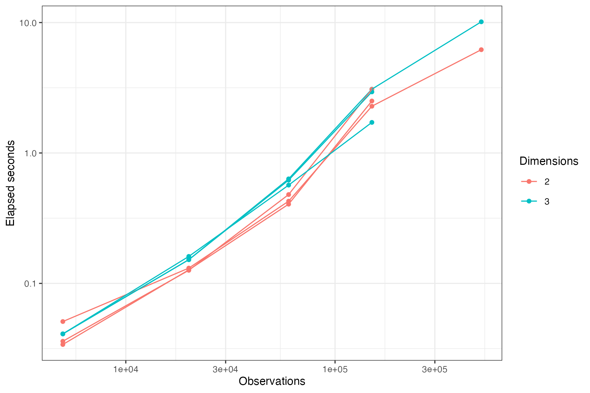
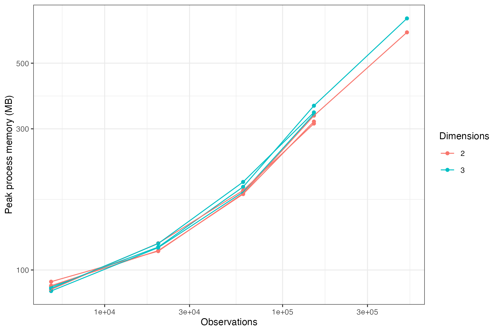

```{r setup, include=FALSE}
knitr::opts_chunk$set(collapse = TRUE, comment = "#>")
```

## Validation design

The simulation benchmark covers eleven geometries, five region-density profiles,
four error mechanisms, two- and three-dimensional coordinates, and single or
multiple tissue sections. Direct competitors consume the same coordinates and
initial labels; end-to-end spatial clustering methods are outside this comparison.

The faster default was selected on 48 paired development scenarios and frozen
before evaluation on 560 independent scenarios. Relative to the previous
configuration, it was 1.68-fold faster overall with a mean accuracy difference of
-0.00022. In the 120 independent 19-class scenarios, it was 1.80-fold faster and
the accuracy difference was +0.00014.

## CPU scaling

With four CPU tile workers, marginSVM processed 500,000 observations in 6.19
seconds in 2D and 10.14 seconds in 3D on the benchmark machine. Peak process
memory was 636 MB and 708 MB, respectively.

```{r runtime-figure, echo=FALSE, out.width="100%", fig.cap="CPU runtime through 500,000 observations."}

```

```{r memory-figure, echo=FALSE, out.width="100%", fig.cap="Peak process memory through 500,000 observations."}

```

## Reproduction

The repository retains raw per-scenario metrics and scripts under `benchmarks/`.
The main speed analyses are reproduced with:

```sh
Rscript benchmarks/marginsvm_speed_tuning.R
Rscript benchmarks/marginsvm_speed_validation.R
Rscript benchmarks/run_marginsvm_scaling.R
```
